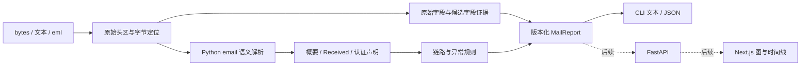

# MailTrace 首版设计

状态：首版核心库与 CLI/JSON 已实现（0.1.0）。2026-10-01 完成详细设计后，按用户“开始项目搭建”的指示落地；80 项测试及独立 wheel 安装验证通过。见 [验证记录](../../testing/validation-v0.1.md)。API、Web、DNS 与数据库按后续版本交付。

配套文档：

- [报告数据契约](../../contracts/report-v0.1.md)
- [完整示例报告](../../contracts/report-v0.1.example.json)
- [解析与规则验收用例](../../testing/acceptance-v0.1.md)
- [落地步骤](../plans/2026-10-01-mailtrace-core.md)

## 目标与交付范围

MailTrace 是可被 MailSecLab 实验直接导入的邮件头分析引擎。首轮实现 V0.1/V0.2：独立 Python package、可读 CLI 报告、JSON 报告及合成测试语料。后续 FastAPI 与 Next.js 复用同一报告模型和分析入口。

首轮成功标准：安装后可以执行 `mailtrace analyze tests/samples/basic.eml` 和 `mailtrace analyze tests/samples/basic.eml --json`；可以通过 `from mailtrace import analyze` 调用 `analyze(raw_email)`，获得 `report.route`、`report.authentication` 和 `report.warnings`。

## 方案选择

1. **推荐：核心库与 CLI 先行。** 按用户提供的版本顺序交付，先验证解析、证据展示与研究复用；网页可视化在后续阶段完成。
2. 同时交付核心库、API 与网页。更早提供交互界面，但首轮需要同时验证 Python、HTTP、文件上传与前端交互，范围较大。
3. 直接制作网页解析器。初期页面开发集中，但不能满足 Python 实验直接导入核心引擎的要求。

## 仓库与模块边界

```text
MailTrace/
├── packages/
│   └── mailtrace-core/
│       ├── pyproject.toml
│       └── src/mailtrace/
│           ├── __init__.py
│           ├── cli.py
│           ├── parser/
│           │   ├── message.py
│           │   ├── received.py
│           │   ├── address.py
│           │   └── auth_results.py
│           ├── analysis/
│           │   ├── route.py
│           │   ├── timestamp.py
│           │   ├── loop.py
│           │   └── anomalies.py
│           └── models/
├── tests/
│   ├── samples/
│   ├── received/
│   └── malformed/
├── docs/
└── README.md
```

后续新增 `apps/api/`、`apps/web/` 和核心库 `dns/` 模块。首版只创建有实际实现与测试的模块，不建立空的应用或 DNS 功能。

核心库不依赖 FastAPI、Web UI 或数据库。目标 Python 3.11+，当前开发机为 Python 3.13.12。标准库 `email` 负责语义解析，`ipaddress` 负责地址分类，标准库日期工具处理邮件时间，Pydantic 2 负责报告模型与 JSON 序列化。首版运行依赖仅 Pydantic；pytest 是开发依赖。确切依赖版本在实现阶段安装后锁定，不在设计中虚构版本。



`analyze` 是同步、离线、无文件写入的函数。CLI 负责文件 I/O 与展示；核心函数不打印，不读取系统时区，不获取 DNS。相同输入与相同选项产生相同报告，首版不在报告中注入当前时间或随机标识。

## 输入与解析

- `analyze(raw_email: bytes | str)` 接收完整邮件或邮件头文本；文件入口读取原始 bytes。
- 邮件头解析保留字段顺序、重复字段、原始字段值和解析缺陷，不能用普通字典覆盖重复字段。原始证据与语义视图分别保存。
- 解码 Subject、显示名称等常见编码字段；展示 From、To、Sender、Return-Path、Message-ID、Date。
- 对 Received 字段提取 from 主机/IP、by 主机、协议、队列 ID、收件人和时间，并保留原始值。
- 接受折叠头、CRLF/LF 和常见 Received 格式；缺少分号或不合法日期的字段保留为部分结果并附警告。
- 对畸形头区报告解析缺陷，不静默宣称已恢复出完整、合规的邮件头。
- 不解析或执行附件，不进行 SMTP 投递，不把邮件内容提交给第三方服务。

### 原始证据与语义边界

`BytesHeaderParser(policy=policy.default)` 提供字段语义和缺陷列表，不是字节无损存储。原始输入另行保存 SHA-256 摘要；头区保存 Base64 字节、各字段的半开区间字节偏移和一基行号。UI 展示文本可用 UTF-8 replacement 解码，证据仍以 Base64 还原的字节为准。`str` 输入明确先编码为 UTF-8；摘要和偏移对应编码后的输入。

轻量字节扫描只负责在第一个空行处分离物理头区、分组折叠行和定位候选字段，不重新实现完整 RFC 5322 语法。没有空行时视为头区文本。正文中任何看起来像 Received 的行都不能进入候选字段或链路。

必须区分三个数量：物理候选 Received 数、Python 识别的 Received 数、实际可解析的跳数。所有被 Python 识别的 Received 都保留在 `route`，即使只能提取部分信息。

2026-10-01 在本机 Python 3.13.12 的探测结果：

| 输入 | Python raw_items | 缺陷 | 首版行为 |
| --- | --- | --- | --- |
| 常见折叠 Received | 保留字段与折叠值 | 无 | 正常结构化 |
| `Received :` 后接 From | 空 | MissingHeaderBodySeparatorDefect | 保留候选原文，标记未识别，不加入传输链 |
| `Receíved:` 后接 From | 空 | MissingHeaderBodySeparatorDefect | 保留异常片段，报告边界差异，不自行恢复后续字段 |

候选字段使用 `recognized: false` 标记未被语义解析器接纳的内容；后续正常形状的字段也可能因为提前终止而未被接纳。差异报告是 Python 视图与原始物理头区之间的诊断，不能宣称是多种 MTA 的实测结果，也不能宣称首版完整支持所有 obsolete 语法。

### Received 提取约束

分隔关键字与分号只能在注释、引号和地址字面量外识别，不能用单条大正则把任意内容强行解析。未知扩展和未提取文字保留在原字段。

- 常见布局是 `from … by … with … id … for … ; date`；from/by 可以缺失，不能编造节点。
- 方括号 IPv4、`[IPv6:…]` 和 IPv6 字面量由 `ipaddress` 验证；多个不同候选 IP 标记 ambiguous，不擅自挑选发送源。
- 保留 hostname 的原始拼写，只有比较键转小写并去掉尾部点；不做域名末尾匹配或未经证据支持的服务器别名合并。
- 结构化失败是字段级缺陷，其他可读取的字段继续生成报告。

## 路由与时间

Received 在头区通常按最新到最早排列。输出 `route` 按传输顺序反转这些记录，不能通过时间排序重排证据。

每跳同时包含原始 Received 序号与路径序号，便于定位；两种序号均从 1 开始。`header_id` 指向唯一原字段，不能把原始 Received 序号误当作全部字段序号。时区完整的时间统一到 UTC 计算相邻延迟，同时保留原始日期文字与时区偏移。缺失时间或未提供时区不能参与确定性的延迟计算。

对于 `-0000`，按 RFC 日期语义解释为 UTC，同时标记来源本地时区未知；不能仅因 Python 返回 naive datetime 就套用开发机时区。对于不能确定语义的时区缩写，保留原文并不计算延迟。

第 1 跳 `delay_seconds` 为 null；第 n 跳计算 `t[n] - t[n-1]`。负数保留并发出时钟异常提示，不能把负值变成零或改变路径顺序。只有相邻每对时间都已知时，`total_observed_delay_seconds` 才能给出首尾差；否则为 null。该值不包括投递前或投递后的未知耗时。

提示包括：无法完整解析的跳、负延迟、明显的主机衔接中断、重复的有向传输边及可疑回返、过长链路、私有 IP 暴露。链长阈值属于可配置的启发式规则，默认 50，不作为 RFC 规定的限制。重复节点、衔接中断与时钟异常都只能作为调查线索，不能直接证明路由环或伪造。

路线连续性检查比较当前跳的 by 与下一跳的 from：任一主机未知时跳过；只有完整主机名不同才发出低置信度信息。相邻两跳共同出现中继节点是正常现象，不能报告循环。已知连续路径 A→B→A 或重复边 A→B 再出现时，报告“疑似回返”，不是“已确认环路”。

私有地址规则使用 IPv4 RFC 1918 网段与 IPv6 `fc00::/7`。loopback、link-local、文档地址等分别分类，不能直接把 Python `is_private` 的所有地址归类为私网泄露。

## 认证结果与信任边界

- 解析 Authentication-Results 中 SPF、DKIM、DMARC、authserv-id 及相关属性，保留多个字段与多条 DKIM 结果。
- 收集 Received-SPF、DKIM-Signature、ARC-Seal 和 ARC-Authentication-Results 的存在与原始证据。
- 没有声明的认证结果显示 unknown；不能把 DKIM-Signature 存在解释成 DKIM pass。
- 所有 pass/fail 都明确表示“邮件头声明的结果”，不是 MailTrace 主动验证的结论；包含 `verified: false` 和结果来源。
- Received 与 Authentication-Results 可能由发送者伪造。未配置可信接收节点时，首版不认定真实发送源，也不把最早的 Received 地址当作已验证来源。
- 地址/域名差异只作为提示，不能仅凭 From 与 Return-Path 不同就认定 DMARC 失败或邮件欺骗。

Authentication-Results 的分段必须理解带引号字符串、转义与嵌套注释，不能直接 `split(';')`。原 method 和 result 保留；未知方法与非标准状态不会被改成 pass。属性使用列表表示，避免重复属性被覆盖。

认证概要按 SPF、DKIM、DMARC 分别计算：无声明为 unknown；仅一个已知状态值为 reported；多个不同值为 mixed。多条 DKIM 签名可能自然产生不同结果，因此 mixed 只是展示状态，不自动触发安全警告。Received-SPF 结果独立保留，不覆盖 Authentication-Results。ARC 首版只展示头部存在与原文，不验证链。

## 报告模型

报告具有明确的 `schema_version`，包含邮件概要、保留顺序的 headers、route、authentication、warnings 与解析缺陷。警告包含稳定 code、严重程度、中文说明和字段/跳的证据引用。

CLI 可读输出提供 Message、Authentication、Route、Warnings 四部分。`--json` 输出单个合法 JSON 文档，诊断信息写入 stderr；非 ASCII 文本保持可读。

正常完成分析返回退出码 0，即使有调查警告；命令参数或输入文件错误返回非零。CLI 首版限制输入为 10 MiB，空输入明确报错。研究用户可直接调用库分析较大语料；库不静默截断输入。

### CLI 交互

```powershell
mailtrace analyze .\tests\samples\basic.eml
mailtrace analyze .\tests\samples\basic.eml --json
mailtrace analyze .\tests\samples\long-chain.eml --chain-limit 50
```

首版只接收文件路径，不加入 stdin、批量扫描或数据库历史；这些功能不会影响核心入口设计。CLI 文本默认 UTF-8，转义输入中的控制字符与 ANSI escape，避免显示邮件头时改变终端内容；原始 JSON 中保留字符，由序列化器完成 JSON 转义。

错误码固定：0 为完成分析，1 为文件读取/分析失败，2 为参数错误。10 MiB 是 10,485,760 字节；读取上限加 1 字节检测越界，不能先把超大文件完整读入内存。库对空输入抛出 ValueError，对非 bytes/str 输入抛出 TypeError；解析缺陷通常通过报告返回。

CLI 文本示例（用于展示，不是已运行结果）：

```text
MailTrace 0.1 — 离线邮件头分析
Message
  Subject       项目进度
  From          alice@sender.example
  To            bob@recipient.example
Authentication — 邮件头声明，MailTrace 未主动验证
  SPF           reported: pass  [mx.recipient.example]
  DKIM          unknown
  DMARC         unknown
Route — 字段声明的传输顺序
  [1] laptop.local → relay.sender.example    ESMTP
      2026-10-01T11:59:43Z
  [2] relay.sender.example → mx.recipient.example    ESMTPS
      2026-10-01T12:00:00Z    +17s
Warnings
  [info] PRIVATE_IP_EXPOSED  hop-1: 192.168.1.10
```

### 可视化界面的信息设计

V0.4 首屏包含输入区与报告区：粘贴邮件头或上传 .eml 后，报告按“概要 → 链路/时间线 → 认证声明 → 异常 → 原始证据”排列。

图上的节点表示主机声明，每条边表示一个 Received 字段。边与详情面板共享 `hop_id`；点击边定位原始字段 `header_id`，点击警告也定位同一证据。缺失主机显示“未知节点”；链路中断用虚线，不补画未经声明的实际传输边。时间线使用 UTC 并展示原始时区，异常负延迟单独标注。

认证卡显示 reported pass/fail/mixed/unknown 与 authserv-id，不采用容易误解为工具已验证的纯绿色“安全”结论。源 IP、真实发件服务器及可信链段在未配置可信接收节点前均不定性。页面布局设计可独立迭代，报告契约无需因此改变。

## 验证与语料

全部提交语料使用合成地址、`.example` 域名和文档 IP，不复制旧实验仓库中的真实邮件或大体积结果。

验证覆盖：正常多跳顺序与时区延迟、折叠字段、重复 From、重复 Authentication-Results、多条 DKIM 结果、缺少或畸形 Received 日期、负延迟、循环线索、私有地址、长链阈值、原始证据保留、邮件正文边界、编码 Subject、JSON schema 与 CLI 文件错误。

集成验证通过安装后的 CLI 和 Python import 执行同一封样本，确认报告一致、JSON 可解析、包不依赖 API 服务。README 提供 Windows/PowerShell 的安装和运行命令。

## 后续迭代

1. **V0.3 FastAPI：** `apps/api/`，提供 `POST /api/v1/analyze`；支持文本与 `.eml` 上传，限制输入大小，返回核心报告。
2. **V0.4 Web UI：** `apps/web/`，Next.js、TypeScript、Tailwind CSS、React Flow；粘贴/上传、传输链图、时间线、认证声明卡片、风险提示与可折叠原始邮件头。首版默认不保存原始邮件。
3. **V0.5 调查扩展：** 显式选择的 DNS 查询（MX/SPF/DMARC/PTR/A/AAAA）、查询时间与超时记录、可信接收节点配置及主动认证验证。当前 DNS 信息不能作为邮件投递当时的验证结果。
4. 需要历史记录时再增加 SQLite；明确保留与删除规则，之后按需求迁移 PostgreSQL。数据库不成为核心分析库的依赖。

## Git 状态

本地 `mailtrace` 跟踪 `origin/tool/mailtrace`。清理提交 `778901d` 已推送，删除 1,862 个继承文件，保留提交历史。`research/received-trace` 仍指向 `7cc5ca7`。后续 MailTrace 内容提交到同一工具分支。

## 依据与设计决策

- 头区、折叠及 trace 顺序依据 [RFC 5322 §2.2.3、§3.6](https://www.rfc-editor.org/rfc/rfc5322.html#section-3.6)。原始证据与结构化视图的分离是 MailTrace 的设计决策。
- 时区 `-0000` 的处理依据 [RFC 5322 §3.3](https://www.rfc-editor.org/rfc/rfc5322.html#section-3.3)。
- 认证声明的信任边界依据 [RFC 8601 §1.2](https://www.rfc-editor.org/rfc/rfc8601.html#section-1.2)。mixed 展示策略是产品设计，不是协议认证结果。
- 使用仅头区的解析器依据 [Python email.parser 文档](https://docs.python.org/3/library/email.parser.html)。上述畸形头行为另由本机 Python 3.13.12 探测，不外推到所有版本。
- JSON 模型与后续 schema 输出依据 [Pydantic 序列化文档](https://docs.pydantic.dev/latest/concepts/serialization/)。
